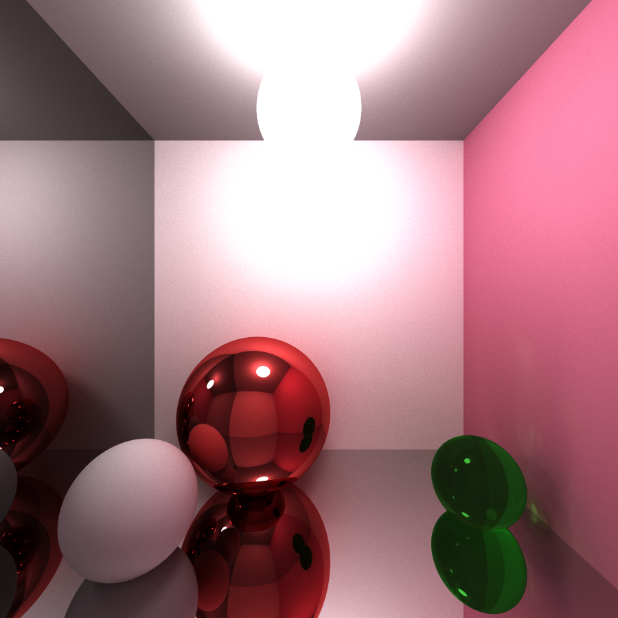
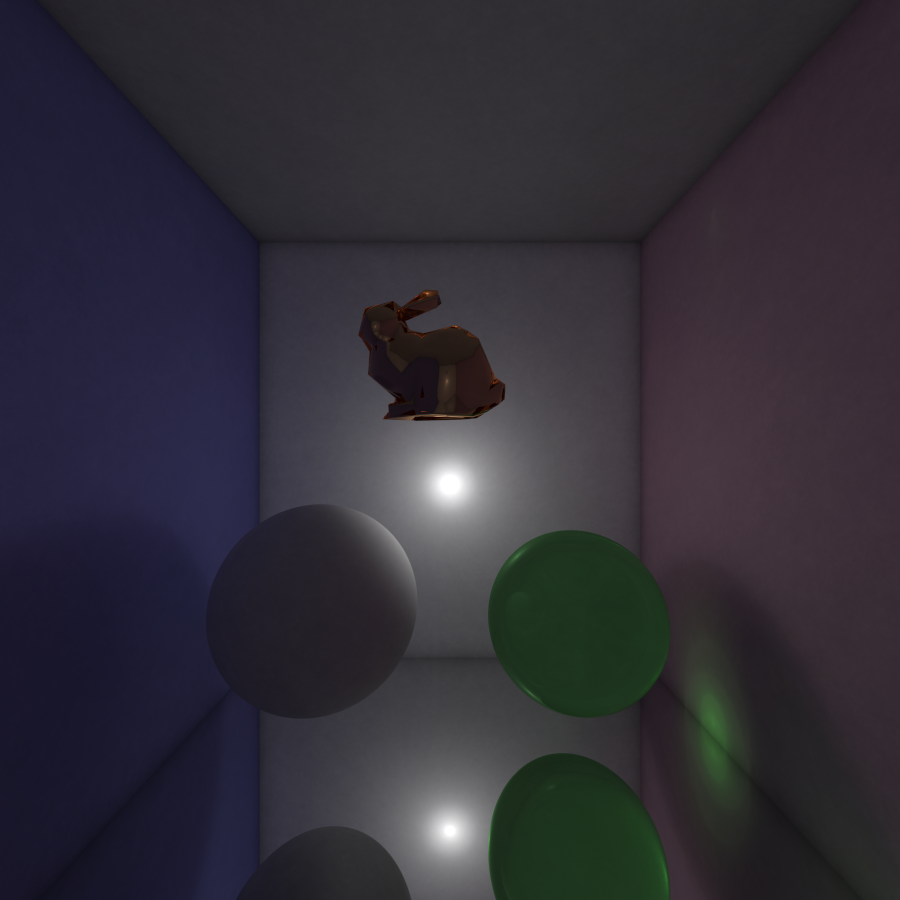
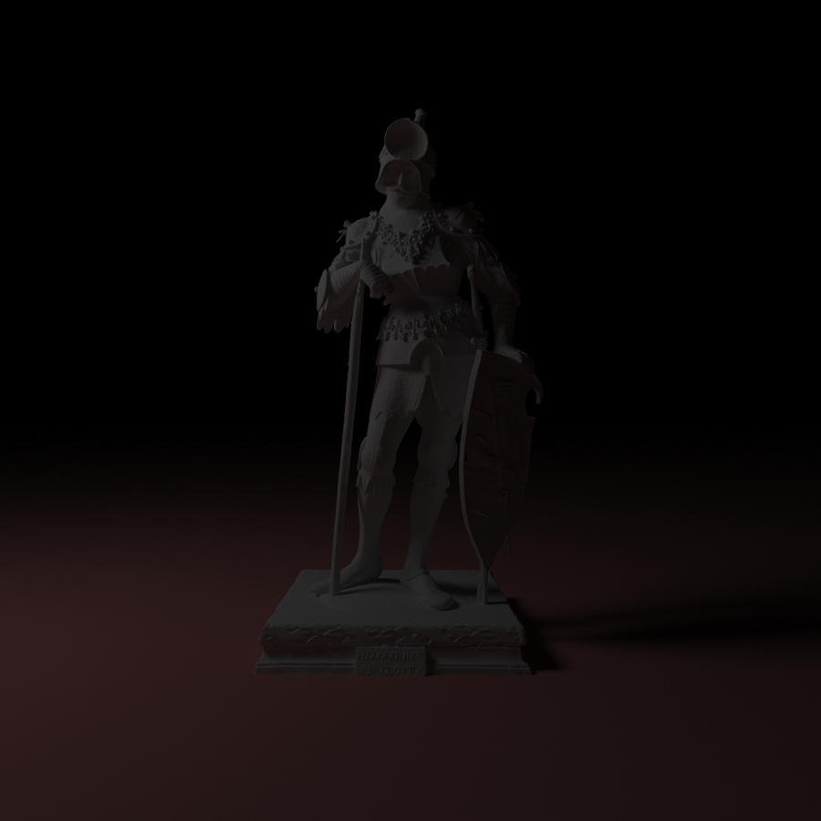
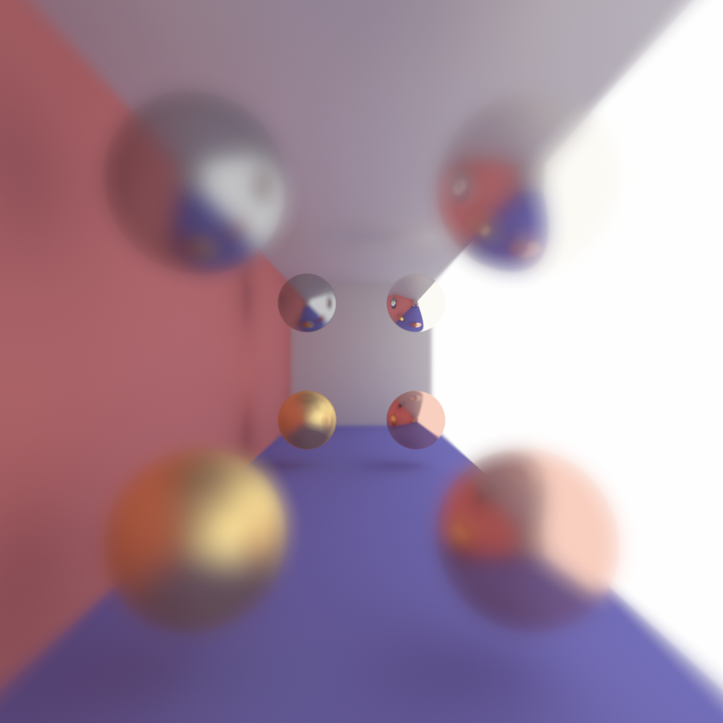
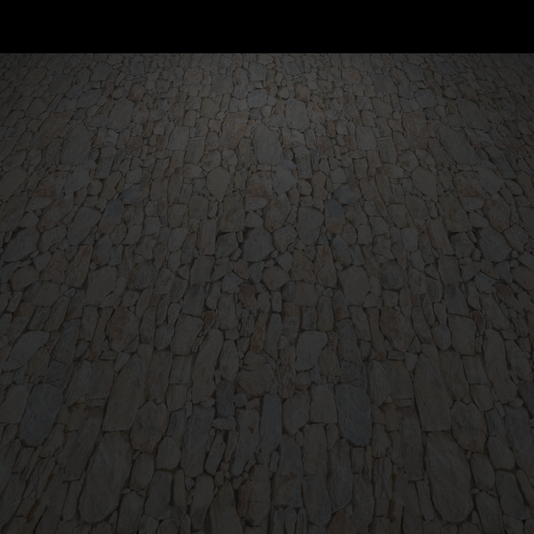
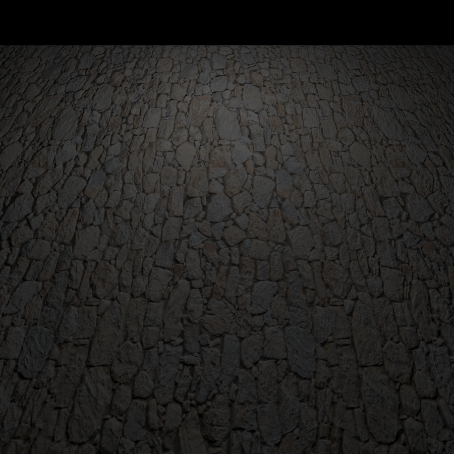
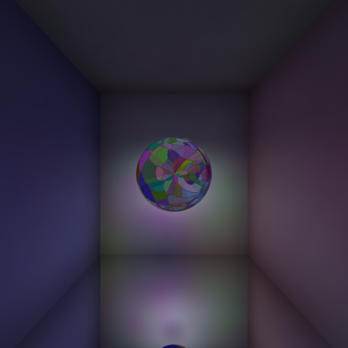
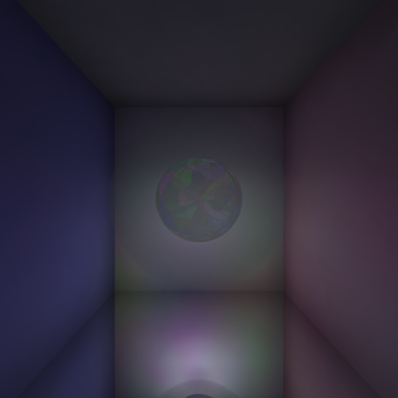
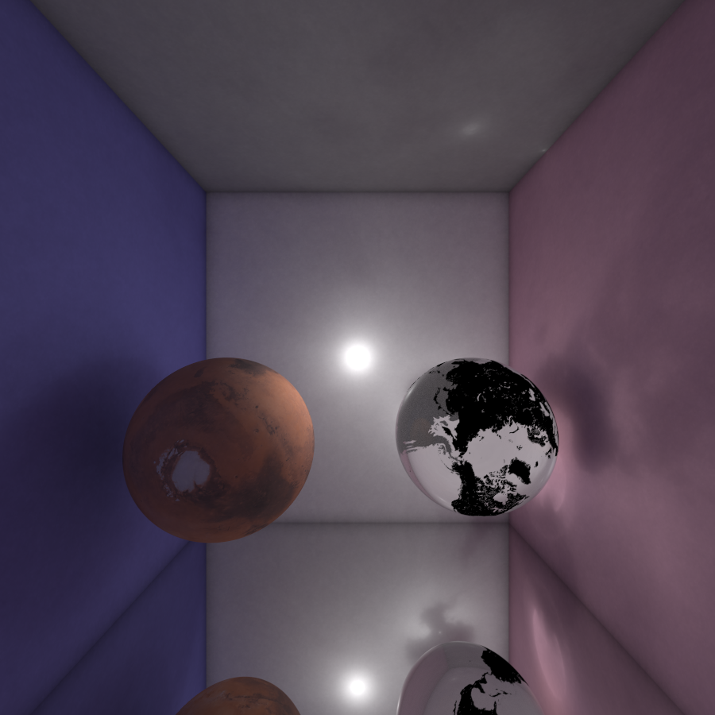

[TOC]

## 代码框架

代码的框架直接沿用之前 PA1 所用到的框架，故而原有代码的框架不作过多赘述。

`include/bound.hpp`：包围盒

`include/kdtree.hpp`：KD Tree 实现的层次包围盒

`include/ppmtree.hpp`：KD Tree 实现的 SPPM 碰撞点的存储

`include/smoothtriangle.hpp`：三角面片的法向插值

`include/rectangle.hpp`：长方体物体

以及部分在原有代码基础上的增改。

## 算法选型

我主要实现了两个算法，分别为 Path Tracing 和 Stochastic Progressive Photon Mapping。

而两种算法的实现差异仅在 `scr/main.cpp` 中体现，故而其他所有的效果均可通用。

当前代码中使用的算法为 SPPM，PT 的代码在 `src/maint.cpp`  中，使用时请将其替换为 `src/main.cpp`。

在实现这些算法时通过重要性采样的方法可以实现抗锯齿和软阴影。

### Path Tracing

实现 Path Tracing 的过程中，从一个像素点发出大量的光线，经过折射、镜面反射、漫反射最后达到光源时终止，为了避免光线无限递归，还采用了轮盘赌的方式来决定光线是否终止。

### Stochastic Progressive Photon Mapping

先从视点进行一遍路径追踪，并用 KD Tree 记录下漫反射的碰撞点（KD Tree 实现可见 `include/ppmtree.hpp`），然后再从光源（实现了点光源和圆盘发出平行光 `include/light.hpp`）发出若干光子，对于落入碰撞点周围有效半径内的光子，估计其的光亮程度。

然后进行若干轮这样的操作，每轮都将有效半径进行缩小。

### 不同算法效果示意图

<center class="half">


</center>

这两张仅为简单的对比图。左图为 PT 的效果，右图为 SPPM 的效果，其中可以看出 SPPM 在焦散的实现上更加有优势。


## 功能实现

### 法向插值

`include/smoothtriangle.hpp`

根据给定的点坐标，先得出其周围三角面片的法向量，然后加权得到点的法向量，三角面片上的点的法向量等于其顶点法向量的加权。

### 求交加速

#### 包围盒

`include/bound.hpp`

用一个与坐标轴平行的包围盒将面片进行包围，然后用 Woo 算法进行求交，若与包围盒有交，再于其内的面片进行求交，在测试集中比无包围盒至少快了 $50\%$。

#### 层次包围盒

`include/kdtree.hpp`

我使用 KD Tree 来实现层次包围盒，每一次选择一个纬度将其从中间分割，然后用一个包围盒将包含在内的面片留住，当此节点数小于 `min_trig`，或者层数达到 `max_step` 时，停止分割，在测试集中比普通包围盒至少快了 $70\%$。

#### 复杂网格求交效果图



该图含有 1,035,735 个顶点，2,071,736 个面片，像素为 $1024\times 1024$，PT 可以在一小时半内得出结果。

### 镜面模糊

`src/main.cpp`

```c++
reflRay.setDirection(reflRay.getDirection() + m->getFuzz() * random_in_unit_sphere(Xi));
```

根据给定的模糊系数，将反射光的方向在一定大小的球上进行随机偏移。

### 景深

`include/camera.hpp`

通过继承原先 `PerspectiveCamera` 类实现了 `PerspectiveCameraWithDefocus` 类。

将原先小孔成像改为在一个给定半径的光圈（圆盘）上随机取点，然后与给定焦距的焦平面上对应点求出从视点发出的光线。

#### 景深与镜面模糊效果图



上图的相机聚焦在远处的球上，且球从右上、右下、左上、左下镜面模糊程度不断增大，也显现出不同的效果。

### 纹理映射

#### UV 纹理映射

`include/hit.hpp`：额外存储了 $(u,v)$ 信息

`include/material.hpp`：新增了 `Texture` 类，对于给定的坐标 $(u,v)$ ，根据设定好的比例尺，返回对应的材质。

`include/object3D.hpp`：新增 `Vector2f transUV(Vector3f pos)` 函数，对于给定的空间位置，返回坐标 $(u,v)$。

##### Bezier 曲面

`include/revsurface.hpp`：并未实现 `transUV`，而是直接对 `Hit` 进行传值。

求交时得到的参数值与 UV 纹理坐标完美对应。

##### 平面/长方形

`include/plane.hpp`，`include/rectangle.hpp`：见 `transUV`。

根据不同的平面分别选择对 xOy、yOz、zOx 平面作投影即可。

##### 球面

`include/sphere.hpp`：见 `transUV`。

公式： $\Big(\frac{\pi+\text{atan2}(y,x)}{2\pi},\frac{\pi-\text{acos}(z)}{\pi}\Big)$。

### 法向映射

将给定的切线坐标系上的法向量转化为世界坐标系上法向量即可。

#### UV 纹理映射与法向映射效果图

<center class="half">


</center>

右图增加了法向映射，图像更加真实。

### 参数曲面解析法求交

`include/revsurface.hpp`

先生成少量面片，在面片上用 KD Tree 求交得到初值，然后根据得到的初值，利用牛顿迭代法求解即可，实际测试 15 轮迭代即有较好的收敛结果。

### 体积雾

`include/sphere.hpp`：见 `FogSphere` 类

我用体渲染实现了球形体积雾，其他形状的体积雾同理。

对于球内的光线实现一个随机步长步进（该分布为指数分布），然后再朝随机的方向进行漫反射，且步长还与体积雾的密度有关。

#### 效果图

<center class="half">


</center>

右图为左图增加了球形体积雾，可以明显看出，右图的光源明显较左图更为分散和朦胧。

### 性能加速

采用 OpenMP，将不同像素以及不同光源分配给不同的线程。

## 其他效果图




